As suggested in one of the previous challenges, the numpy library provides an object called array, which is very similar object to the list. The main difference is the set of operations that can be performed on them. Numpy arrays are oriented towards computation.

In this lesson we are going to learn a little more about how to use this fundamental library to do any numerical analysis in Python.

Numpy extends the Python language by providing new types (array, matrix, masked_array...), functions and methods to realise efficient numerical calculation using Python.

As we saw in the Introduction course, the most basic numpy type is called an array. The most basic array is a multi-dimensional object which contains numerical data.

[Numpy](https://www.numpy.org) is _the_ numerical library for Python. It is too big to be covered in one day, so today we will learn a few of the basic objects and functions.

Numpy is a foundation block for all other python libraries used in science and data science, e.g.:
- [scipy](https://www.scipy.org) Fundamental library for scientific computing (interation, optimisation...)
- [pandas](https://pandas.pydata.org) data structure and data analysis tools
- [matplotlib](https://matplotlib.org) Python 2D plotting

And more specialised libraries such as:
- [astropy](https://www.astropy.org) for astronomy
- [h5py](https://www.h5py.org) to interact with HDF5 format datafiles
- [scikit-learn](https://scikit-learn.org) for Machine Learning
- [TensorFlow](https://www.tensorflow.org) for Deep Learning

We are going to learn some of the basic commands not seen in the first course. We will introduce some of these libraries but keep in mind that we are just covering the basics so you can understand how to start using this library. If you find that your interest is piqued and/or they are applicable to your problem, you can use the documentation to learn more.

To start, we are going to import the two libraries `numpy` and `matplotlib` that will be used in this episode.

~~~
import numpy as np
import matplotlib.pylab as plt
~~~
{: .language-python}
Here we import the libraries using a common shorthand for them, `np` for `numpy`, and `plt` for `matplotlib.pylab`. You will encounter this in many python scripts using these libraries, and we will continue to use these shorthands below.

Numpy has a number of functions which behave similar to basic python functions. For example, to create a `list` of odd numbers from 1 to 9 we would use `range` and `list`:
~~~
odds = list(range(1,10,2))
print('odds is type {}, and contains {}'.format(type(odds),odds))
~~~
{: .language-python}
~~~
odds is type <class 'list'>, and contains [1, 3, 5, 7, 9]
~~~
{: .output}
To create a numpy array we can use `np.arange`:
~~~
odds_np = np.arange(1,10,2)
print('odds_np is type {}, and contains {}'.format(type(odds_np),odds_np))
~~~
{: .language-python}
~~~
odds_np is type <class 'numpy.ndarray'>, and contains [1 3 5 7 9]
~~~
Note that we did not need to convert the output of `np.arange`, as we did for the output of `range`, because `np.arange` returns directly a numpy array, rather than returning an iterator.

> ## Numpy Array Addition
>
> What is the difference between addition of numpy arrays and lists? What is the result
> of these two additions?
> ~~~
> odds + odds
> odds_np + odds_np
> ~~~
> {: .language-python}
> 1. `[1,3,5,7,9,1,3,5,7,9]` for both
> 2. `[1,3,5,7,9,1,3,5,7,9]` for odds, and `[2,6,10,14,18]` for odds_np
> 3. `[2,6,10,14,18]` for odds, and `[1,3,5,7,9,1,3,5,7,9]` for odds_np
> 4. `[2,6,10,14,18]` for both
>
> > ## Solution
> > The correct answer is (2)
> {: .solution}
{: .challenge}

### Reshaping Numpy Arrays

Numpy arrays are multidimensional objects for storing data (not necessarily numerical). The shape of the array can be modified using the method `reshape`:
~~~
arr = np.arange(1,18,2)
arr_2d = arr.reshape((3,3))
print('arr has shape {}, and contains:'.format(arr.shape))
print(arr)
print('arr_2d has shape {}, and contains:'.format(arr_2d.shape))
print(arr_2d)
~~~
{: .language-python}
~~~
arr has shape (9,), and contains:
[ 1  3  5  7  9 11 13 15 17]
arr_2d has shape (3, 3), and contains:
[[ 1  3  5]
 [ 7  9 11]
 [13 15 17]]
~~~
{: .output}

Checking and changing the type of the data within the array is relatively straightforward:
~~~
print(arr.dtype)
arr = arr.astype(float)
print(arr.dtype)
~~~
{: .language-bash}
~~~
int64
float64
~~~
{: .output}

### Working with Matricies

Numpy arrays are not matrix objects, but numpy does provide a matrix object, which has the characteristics of a mathematical matrix:
~~~
mat = np.matrix(arr_2d)
type(mat)
~~~
{: .language-python}
~~~
numpy.matrix
~~~
{: .output}

These can be used to carry out matrix multiplication:
~~~
mat * mat
~~~
{: .language-python}
~~~
matrix([[ 87., 105., 123.],
        [213., 267., 321.],
        [339., 429., 519.]])
~~~
{: .output}

## Masked Arrays

A very useful tool that numpy provides for working with experimental data is the masked array. When you are taking data from an experiment you always have some data which are not present, or with a bad signal to noise ratio, or that you cannot use for some other reason. This function allows you to select which data you wish to work with within your dataset.

Masked arrays associate a numpy array with another array composed only of boolean values (True or False). These tell numpy whether to use (or not) the respective element.

To demonstrate this we are going to create a Gaussian function and use it to generate an example dataset and generate a plot. We will then add some noise to it and use a masked array to filter out the noisy data. This represents the kind of processing that can be used for datasets such as a seismographs, where we would wish to isolate single events from noisy background data.

Reminder: the Gaussian function is define by:
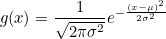

> ## Gaussian Function
> 1. Create a function called `gauss` which will take three arguments (inputs):
> **x**, **µ**, and **σ**,
> as defined above. (x is an array, µ is the position of the centre of the
> curve/peak and σ is the width of the bell)
> 2. Create a numpy array using the 'numpy' function 'linspace' which will contain 1000
> points equally spaced between x=-100 and x=100. Hint: You can print the help
> documentation of a function with 'help(name_of_the_function)'
> 3. Using the above gauss function and the array, create a list which contains the value
> of the gauss from x=-100 to x=100.
> 4. Use the 'matplotlib' library to plot the curve with mu=0 and sigma=10.
>
> > ## challenge 1:
> > ~~~
> > def gauss(x, mu=0, sigma=1):
> >     return (1./(sigma * np.sqrt(2 * np.pi)) *
> >             np.exp( - (x - mu)**2 / (2 * sigma**2)))
> > ~~~
> > {: .language-python}
> {: .solution}
>
> > ## challenge 2:
> > ~~~
> > x = np.linspace(-100, 100, 1000)
> > ~~~
> > {: .language-python}
> {: .solution}
>
> > ## challenge 3:
> > ~~~
> > mu = 0   # the position of the center of the peak
> > sigma = 10  # # The width of the 'bell'
> > g = gauss(x, mu, sigma)
> > ~~~
> > {: .language-python}
> {: .solution}
>
> > ## challenge 4:
> > ~~~
> > plt.plot(x, g)
> > plt.show()
> > ~~~
> > {: .language-python}
> > 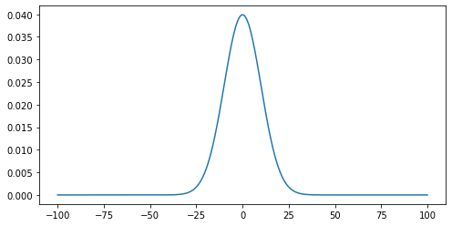
> {: .solution}
{: .challenge}

## Noisy Signal

Now we are going to add some random noise to that curve. To do it we can use the numpy function `normal` from the module `random` provided by numpy library. We will scale the magnitude of the noise so it is (roughly) a 10th of the magnitude of the gaussian maximum:
~~~
noisy = np.random.normal(g, scale=g.max()/10)
plt.plot(x, noisy)
plt.show()
~~~
{: .language-python}
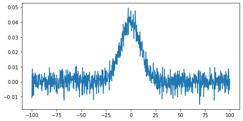

To identify any signal in the data we can use the standard deviation as an estimate of the noise around the mean value of the data.
~~~
stddev_noisy = np.std(noisy)
mean_noisy = np.mean(noisy)
print('standard deviation is: {}'.format(stddev_noisy))
print('mean value is: {}'.format(mean_noisy))
~~~
{: .language-python}
~~~
standard deviation is: 0.011592652442611553
mean value is: 0.005047252119578472
~~~
{: .output}

We will create a mask for the data, by selecting all datapoints below this threshold value (we'll assume here that any signal we might be interested in is positive):
~~~
mask = noisy < (stddev_noisy + mean_noisy)
~~~
{: .language-python}
This creates an array of boolean values, the same shape as our original data, with `True` values where the conditional statement has been met.

The mask and noisy data can now be combined using the `array` function of the numpy masked arrays module (`np.ma`). Any `True` value in the mask will exclude the corresponding element from subsequent computation or plotting:
~~~
noisy_ma = np.ma.array(noisy, mask=mask)
plt.plot(noisy_ma)
plt.show()
~~~
{: .language-python}
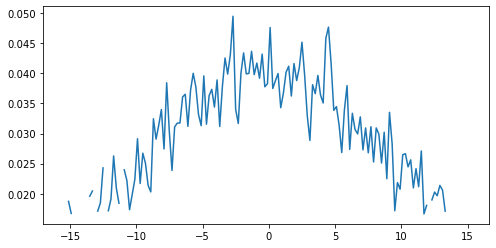

## Working with images

We are going to learn some commands that deal with images. Since most scientific domains use their own file format, we obviously can not learn all of them. We will use a typical astronomical image format: the 'fits' file.

In the data directory you should find a file called 502nmos.fits.

We can verify that the file is indeed here:

~~~
cd data
ls *.fits
~~~
{: .language-python}

We need to use the astropy I/O library fits to open this file. This can be imported as:
~~~
import astropy.io.fits as pyfits
~~~
{: .language-python}

The file can now be opened using:
~~~
im1 = pyfits.open('data/502nmos.fits')
~~~
{: .language-python}

> ## Memory management for large files
> By default pyfits opens a file with the option `memmap=True`. This option opens the fits
> file withou copying the data into memory and allows us to open very large files which
> will not fit into physical memory.
{: .callout}

Fits files are composed of a list of HDUs (Header and data units). We can list the information with the method `info`.
~~~
im1.info()
~~~
{: .language-python}
~~~
Filename: data/502nmos.fits
No.    Name      Ver    Type      Cards   Dimensions   Format
  0  PRIMARY       1 PrimaryHDU     290   (1600, 1600)   float32
  1  502nmos_cvt.tab    1 TableHDU       353   1R x 49C   [D25.17, D25.17, E15.7, E15.7, E15.7, E15.7, E15.7, E15.7, E15.7, E15.7, A1, E15.7, I12, I12, D25.17, D25.17, A8, A8, I12, E15.7, E15.7, E15.7, E15.7, E15.7, E15.7, I12, I12, I12, I12, I12, I12, I12, I12, A48, E15.7, E15.7, E15.7, E15.7, E15.7, E15.7, E15.7, E15.7, E15.7, E15.7, E15.7, E15.7, E15.7, E15.7, E15.7]
~~~
{: .output}
Here we're only interested in the primary HDU which is an image and is called *PRIMARY*.
The base file system can be accessed in the same manner as a dictionary - using either the key `im1['PRIMARY']` or the index `im1[0]`.

The image comprises of two parts: a header, and then the image data. The header can be accessed using the `header` attribute:
~~~
im1['PRIMARY'].header
~~~
{: .language-python}
~~~
SIMPLE  =                    T / FITS STANDARD
BITPIX  =                  -32 / FITS BITS/PIXEL
NAXIS   =                    2 / NUMBER OF AXES
NAXIS1  =                 1600 /
NAXIS2  =                 1600 /
EXTEND  =                    T / There maybe standard extensions
BSCALE  =                1.0E0 / REAL = TAPE*BSCALE + BZERO
BZERO   =                0.0E0 /
OPSIZE  =                 2112 / PSIZE of original image
ORIGIN  = 'STScI-STSDAS'       / Fitsio version 21-Feb-1996
FITSDATE= '2005-07-01'         / Date FITS file was created
FILENAME= '502nmos_cvt.hhh'    / Original filename
...
~~~
{: .output}

To access the data we use the `data` attribute:
~~~
imdata = im1['PRIMARY'].data
type(imdata)
~~~
{: .language-python}
~~~
<class 'numpy.ndarray'>
~~~
{: .output}
Note that this data is in the form of a numpy array, and so we can use our standard numpy tools for processing and displaying this data.

To start with we will look at the unprocessed image of the nebulae:
~~~
plt.imshow(imdata, origin='lower', cmap='gray')
plt.colorbar()
~~~
{: .language-python}
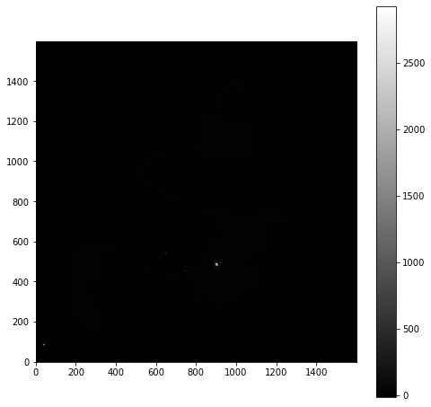

As is common for astronomical images, it is difficult to see anything on this image because a few very bright objects within the frame have saturated the CCD, and so a linear output shows only a limited number of pixels.

To improve the visible output we will carry out some simple analysis of the image, so that we can solve this contrast problem.

First we examine the general stats of the data (using built-in methods, except for the median, which has to be called from numpy directly):
~~~
print('mean value im1:', imdata.mean())
print('median value im1:', np.median(imdata))
print('max value im1:', imdata.max())
print('min value im1:', imdata.min())
~~~
{: .language-python}
~~~
mean value im1: 6.237272
median value im1: 6.7385635
max value im1: 2925.8718
min value im1: -12.439324
~~~
{: .output}
These show that, while the range is very large, the mean and median values are both very low, suggesting that there are only a few pixels with very high values.

This can be confirmed by plotting a histogram of the number of pixels vs the number of photons:
~~~
hist = plt.hist(imdata.ravel(), bins=100)
plt.xlabel('Number of Photons')
plt.ylabel('Pixel Count')
~~~
{: .language-python}
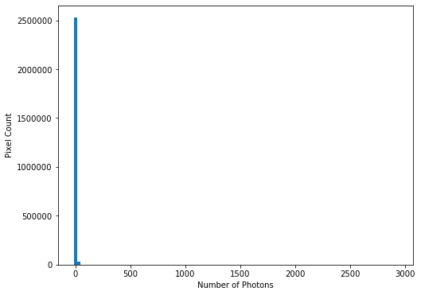
This confirms our suspicions that many pixels have very low photon counts.

> ## Flattening N-D arrays
> To plot a histogram of all the data we needed to flatten the two dimensional data array.
> This was done using the built-in `ravel` function.
{: .callout}

To see the full range of photon counts we will use a log scale:
~~~
hist = plt.hist(imdata.ravel(), bins=100)
plt.yscale('log')
plt.xlabel('Number of Photons')
plt.ylabel('Pixel Count')
~~~
{: .language-python}
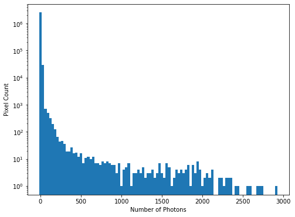

While almost all pixels have a photon count of zero (or near zero), only a few (<1000) photon counts are above 100. There does appear to be a significant number of pixels with values between these two extremes though, so we will constrain the range of our x-axis to between the limits of 1 and 30, to better see these data. The limit of 30 is obtained through previous analysis - if you were carrying out this investigation of the data yourself you would use trail and error to find the best cut-off point for this plot.
~~~
hist = plt.hist(imdata.ravel(), bins=100, range=(1,30))
plt.xlabel('Number of Photons')
plt.ylabel('Pixel Count')
~~~
{: .language-python}
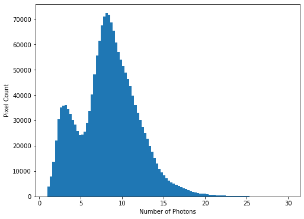
We see that there is a bi-modal distribution, with the largest peak around 8-9 photons, and a smaller peak around 3-4 photons.

Now that we can see that the majority of the data is below a photon count of 25, we can start manipulating our image plot to see more details of the nebulae:
~~~
plt.imshow(imdata, origin='lower', cmap='gray', vmax=25)
plt.colorbar()
~~~
{: .language-python}
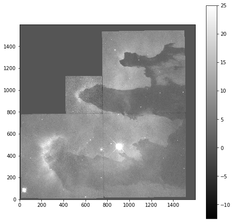

### Masked Arrays (part 2)

Rather than applying the filtering of our data within the plotting tool, we can instead use masked arrays to filter our data. This allows for more nuanced filtering of the data.

We begin with creating a mask to remove values greater than 25:
~~~
immasked - np.ma.masked_greater(imdata, 25)
~~~
{: .language-python}

The `immasked` array contains the `imdata` data (you can test this by plotting `immasked` using `imshow` as we did at the start of this section). It also contains an attribute `mask`, which is applied to filter the data when it is plotted. We can plot this directly to see what is being removed:
~~~
plt.imshow(immasked.mask, cmap='gray', origin='lower')
~~~
{: .language-python}
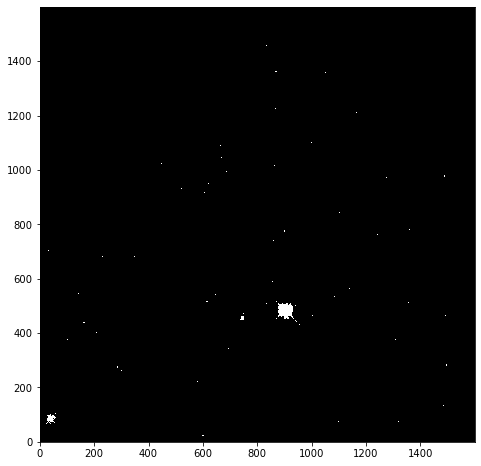

This mask is applied to the data for all built-in functions. But where we have to directly use a numpy function we have to make sure we use the equivalent function in the mask (`ma`) library:
~~~
print('original average:', imdata.mean())
print('Masked average:', immasked.mean())
print()
print('original max:', imdata.max())
print('Masked max:', immasked.max())
print()
print('original min:', imdata.min())
print('Masked min:', immasked.min())
print()
print('original median:', np.mean(imdata))
print('Masked median:', np.ma.median(immasked))
~~~
{: .language-python}
~~~
original average: 6.237272
Masked average: 5.976717048232941

original max: 2925.8718
Masked max: 24.981937

original min: -12.439324
Masked min: -12.439324

original median: 6.237272
Masked median: 6.725283622741699
~~~
{: .output}

> ## Removing negative photon counts
> Photon counts cannot be negative, but some of our data is (some is due to no
> measurements being taken, and some is also likely due to sampling
> errors). So we would like to remove these erroneous data from our plot too.
> 1. Create a new masked array (`immasked2`) where the lower limit is set to zero (you can use the `np.ma.masked_less_equal` function to do this).
> 2. Update the immasked2.mask to apply both masks (you can use the logical or `|` operator to do this). Then plot the new asked data array.
>
> > ## New mask
> > ~~~
> > immasked2 = np.ma.masked_less_equal(imdata, 0)
> > ~~~
> > {: .language-python}
> {: .solution}
>
> > ## Combining masks
> > ~~~
> > immasked2.mask = immasked2.mask | immasked.mask
> > ~~~
> > {: .language-python}
> >
> > ~~~
> > plt.imshow(immasked2, cmap='gray', origin='lower')
> > plt.colorbar()
> > ~~~
> > {: .language-python}
> > 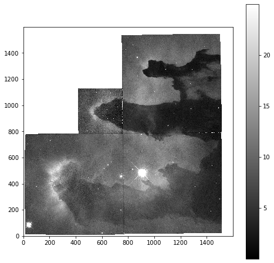
> {: .solution}
{: .challenge}



