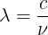
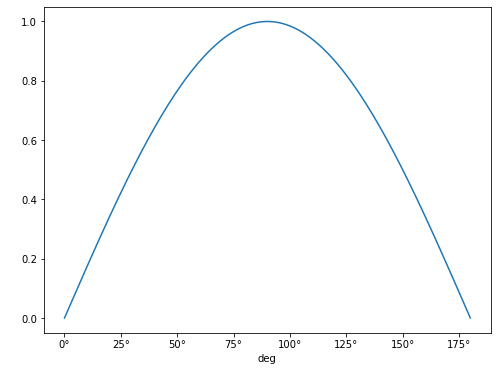
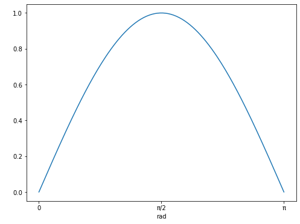

::::::::::::::::::::::::::::::::::::::: objectives

- Creating quantity objects which include values and units
- Applying unit conversions
- Learn about different types of equivalence for units
- Using units for annotating plots
- Test different unit libraries

::::::::::::::::::::::::::::::::::::::::::::::::::

:::::::::::::::::::::::::::::::::::::::: questions

- How can I ensure consistent units in my code?

::::::::::::::::::::::::::::::::::::::::::::::::::

One of the most common problems in physics and the development of physical models is related to the conversion and management of physical units. Without clear management of physical units, and ensuring that the information passed between different parts of the system is consistent, accidents such as the [Mars Climate Orbiter probe crash](https://en.wikipedia.org/wiki/Mars_Climate_Orbiter) can occur.

In this lesson we will look at one of the available libraries in python for helping to avoid such problems. This is the [units](https://docs.astropy.org/en/stable/units/index.html) module in the [astropy](https://docs.astropy.org/en/stable/index.html) library.

## Installing a new python library

Following the conda lesson, we install the astropy library using:

```bash
conda install astropy
```

The `units` module can then be imported in your scripts using:

```python
from astropy import units as u
```

Importing as `u` is not necessary, but it is a common shorthand for this module, and so we'll use it below.

## Basics

Units can be added to a python variable by multiplying that variable by the unit:

```python
length = 26.2 * u.meter
```

(note the use of US spellings for units).

When printing the variable the unit information will now be attached:

```python
print(length)
```

The type of this new variable is an `astropy` `Quantity`:

```python
type(length)
```

```output
astropy.units.quantity.Quantity
```

You can still access the original object using `value`:

```python
print(length.value)
type(length.value)
```

```output
26.2
float
```

Quantities can be converted to other units, systems or factors, by using the function `to()`. For example:

```python
length.to(u.km)
length.to(u.lightyear)
```

This enables the use of arithmetic operations when quantities have compatible units:

```python
distance_start = 10 * u.mm
distance_end = 23 * u.km
length = distance_end - distance_start
print(length)
```

And it also enables the combining of quantities, for example, to calculate a speed:

```python
time = 15 * u.minute
speed = length / time
print(speed)
```

By default the units library will select units to report for these values based on what the units are of the objects that you have passed it. You can, as before, convert these to the units of your choice:

```python
print(speed.to(u.km/u.s))
```

You can also convert the units to the base (irreducible) units for the unit system you are using with the `decompose` function (changing the unit system choice will be covered later):

```python
print(speed.decompose())
```

:::::::::::::::::::::::::::::::::::::::::  callout

## Choosing different base units

If you wish to reduce to different base units you can pass a list of those units to the `bases` parameter when calling the `decompose` function:

```python
print(speed.decompose(bases=['km','s']))
```

Note that the order of the values in the list passed to `bases` parameter doesn't matter. However, the base units you choose must be either one of the original units used, or a standard base unit. This function cannot be used to convert from km to cm, for example. Instead it is useful where you only want to reduce select units within the object.


::::::::::::::::::::::::::::::::::::::::::::::::::

You can change the base system using functions such as `si` (to change to the default SI units) and `cgs` (to change to centimetre-grams-seconds units):

```python
print(speed.cgs)
```

:::::::::::::::::::::::::::::::::::::::  challenge

## Reducing more complex quantities

We have been given some (slightly messy) code that calculates the
[jerk](https://en.m.wikipedia.org/wiki/Jerk_\(physics\)), or rate of change of
acceleration, of a vehicle in the units `m/h/min^2`:

```python
acceleration = (25 * u.meter) / (15 * u.minute) / (15 * u.minute)
time_change = 1 * u.hour
jerk = acceleration / time_change
print(jerk)
```

```output
0.1111111111111111 m / (h min2)
```

For the report we are writing we need to convert this to the units `km/hour^3`, which of
these changes will do this task for us?

1. `jerk.decompose(bases=['km','hr'])`
2. `jerk.to(u.km/u.hour**3)`
3. `jerk.to(u.km/u.hour**2)`

:::::::::::::::  solution

## Solution

Answer 2 is correct. Decompose will only reduce to base units (or existing units), and
so can't change minutes to hours, or metres to kilometres. Answer 3 won't work,
because we have to apply the modification to all units (including those which are
already correct).


:::::::::::::::::::::::::

::::::::::::::::::::::::::::::::::::::::::::::::::

## Imperial Units

The `units` library is focused on scientific notation. To use units from the (US) imperial system we can import the `imperial` library:

```python
from astropy.units import imperial
```

These can then be used in the same manner as the standard units:

```python
speed.to(imperial.mile/u.hour)
```

## Equivalent Units

There are some unit conversions that would initially appear to be unconvertible. For example, it is possible to convert meters into Hertz. At first glance it seems to be wrong but if you know the quantities for wavelength and frequencies, it is indeed a valid conversion:
{alt='Equation for speed of light.'}
where:

- *lambda* ~ m
- c ~ m/s
- \~ *Hz* ~ 1/s

This, however, does not work as above:

```python
(656.281 * u.nm).to(u.Hz)
```

Instead we need to inform `units` what unit equivalency we want it to use, which can be specified with the `equivalencies` option:

```python
(656.281 * u.nm).to(u.Hz, equivalencies=u.spectral())
```

In this case we use the `spectral` equivalence library, which allows conversions between wavelengths, wave number, frequency, and energy equivalent pairs. There are a number of other built-in equivalency libraries, for commonly used pairings.

Other built-in equivalencies are:

- Doppler (`dopplr_radio`, `doppler_optical`, `doppler_relativistic`)
- spectral flux density
- temperature
- brightness temperature
- temperature energy
- and you can [build your own](https://docs.astropy.org/en/stable/units/equivalencies.html#writing-new-equivalencies)

Finding equivalencies is possible using the `find_equivalent_units` function:

```python
u.Hz.find_equivalent_units()
```

```output
  Primary name | Unit definition | Aliases
[
  Bq           | 1 / s           | becquerel    ,
  Ci           | 3.7e+10 / s     | curie        ,
  Hz           | 1 / s           | Hertz, hertz ,
]
```

This is a quite limited list - to see what is available for other equivalence libraries, we must specify these when making the request:

```python
u.Hz.find_equivalent_units(equivalencies=u.spectral())
```

```output
  Primary name | Unit definition        | Aliases
[
  AU           | 1.49598e+11 m          | au, astronomical_unit            ,
  Angstrom     | 1e-10 m                | AA, angstrom                     ,
  Bq           | 1 / s                  | becquerel                        ,
  Ci           | 3.7e+10 / s            | curie                            ,
  Hz           | 1 / s                  | Hertz, hertz                     ,
  J            | kg m2 / s2             | Joule, joule                     ,
  Ry           | 2.17987e-18 kg m2 / s2 | rydberg                          ,
  cm           | 0.01 m                 | centimeter                       ,
  eV           | 1.60218e-19 kg m2 / s2 | electronvolt                     ,
  earthRad     | 6.3781e+06 m           | R_earth, Rearth                  ,
  erg          | 1e-07 kg m2 / s2       |                                  ,
  jupiterRad   | 7.1492e+07 m           | R_jup, Rjup, R_jupiter, Rjupiter ,
  k            | 100 / m                | Kayser, kayser                   ,
  lyr          | 9.46073e+15 m          | lightyear                        ,
  m            | irreducible            | meter                            ,
  micron       | 1e-06 m                |                                  ,
  pc           | 3.08568e+16 m          | parsec                           ,
  solRad       | 6.957e+08 m            | R_sun, Rsun                      ,
]
```

## Angles

The numpy trigonometry functions (`np.sin`, `np.cos`, etc) require angles that are passed to them to be in radians, rather than degrees. It is inconvenient to have to explicitly convert from other units to radians every time that you wish to use these functions, but with units you can have this done implicitly for you.

The radian unit is `u.rad`, and it's equivalencies are:

```python
u.rad.find_equivalent_units()
```

```output
  Primary name | Unit definition | Aliases
[
  arcmin       | 0.000290888 rad | arcminute ,
  arcsec       | 4.84814e-06 rad | arcsecond ,
  cycle        | 6.28319 rad     | cy        ,
  deg          | 0.0174533 rad   | degree    ,
  hourangle    | 0.261799 rad    |           ,
  mas          | 4.84814e-09 rad |           ,
  rad          | irreducible     | radian    ,
  uas          | 4.84814e-12 rad |           ,
]
```

We can see from this that the degree unit is `u.deg`, so we can use this to define our angles:

```python
angle = 90 * u.deg()
print('angle in degrees: {}; and in radians: {}'.format(angle.value,angle.to(u.rad).value))
```

```output
angle in degrees: 90.0; and in radians: 1.5707963267948966
```

Now we can pass the angle directly to `np.sin` without having to convert directly to radians:

```python
print('sin of 90 degrees is: {}'.format(np.sin(angle)))
print('sin of pi/2 radians is: {}'.format(np.sin(1.57079632)))
print('sin of 90 degrees is not: {}'.format(np.sin(90)))
```

```output
sin of 90 degrees is: 1.0
sin of pi/2 radians is: 1.0
sin of 90 degrees is not: 0.8939966636005579
```

### Plotting Quantities

Support has been added for using the units information in matplotlib plots. To use this we need to import the `quantity_support` library:

```python
from astropy.visualization import quantity_support
```

We will create a numpy array of the angles between 0-180 degrees, and plot the sin of these:

```python
angles = np.arange(181) * u.deg
```

```python
plt.plot(angles, np.sin(angles))
```

{alt='Plot of sin curve for degrees between 0-180'}
Note that the units for the x-axis are properly presented. This can be done for any angular unit we wish:

```python
plt.plot(angles.to(u.rad), np.sin(angles))
```

{alt='Plot of sin curve for degrees between 0-180'}

## Temperature

Each of the temperature scales is considered as using an irreducible unit in standard usage. As a consequence of this we need to always specify that we are using the `u.temperature` equivalences when we convert between these:

```python
t2 = 1 * u.deg_C
print('{} is equivalent to {}'.format(t2,t2.to(imperial.Fahrenheit, equivalencies=u.temperature())))
```

```output
1.0 deg_C is equivalent to 33.8 deg_F
```

But, be aware that these are scales, if we wanted to increase a temperature given in Fahrenheit by 1 degree Celsius, we would not add 33.8 degrees Fahrenheit!

To get the incremental value of 1 degree Celsius in Fahrenheit we would need to do this:

```python
t1 = 0 * u.deg_C
t2 = 1 * u.deg_C
print('{} increment is equivalent to a {} increment'.format(
    t2 - t1,
    t2.to(imperial.Fahrenheit,equivalencies=u.temperature())
        - t1.to(imperial.Fahrenheit, equivalencies=u.temperature())
    )
)
```

```output
1.0 deg_C increment is equivalent to a 1.7999999999999972 deg_F increment
```

This is verging on unreadable (as is demonstrated by us having to split a simple arithmetic expression involving two variables across two lines of code).

Fortunately there is support for cleaner temperature conversions in the [pint](https://pint.readthedocs.io/en/latest/index.html) package. This has similar functionality to the `astropy.unit` package, but has been built from the ground up with a focus on different aspects. These include unit parsing and standalone unit definitions, uncertainties integration, and (important for our example here), cleaner treatment of temperature units.

Pint can be installed using conda (and the conda-forge channel):

```bash
conda install -c conda-forge pint
```

The unit registry is loaded using:

```python
from pint import UnitRegistry
ureg = UnitRegistry()
```

A units definition file could be given here if needed, but in this case we will stick with the default settings.

This library has the temperature units as before:

```python
t2 = 1 * ureg.degC
print('{} is equivalent to {}'.format(t2,t2.to(ureg.degF)))
```

```output
1 degree_Celsius is equivalent to 33.79999999999993 degree_Fahrenheit
```

But it also includes the concept of temperature increments:

```python
deltaT = 1 * ureg.delta_degC
print('{} is equivalent to {}'.format(deltaT,deltaT.to(ureg.delta_degF)))
```

```output
1 delta_degree_Celsius is equivalent to 1.7999999999999998 delta_degree_Fahrenheit
```

Because of the popularity of python this overlap of functionality of packages can be common. We would recommend exploring the different available packages that might cover your requirements before settling on one. And keep watching out for new packages, and be prepared to switch when starting new projects if/when you find better packages.


:::::::::::::::::::::::::::::::::::::::: keypoints

- `astropy.units` library provides unit support
- `Quantity` objects are created by multiplying values by the desired units
- The `.to()` function can be used to convert units
- The `.decompose()` function can be used to convert to the base (irreducible) units
- Equivalences can be found using the `.find_equivalent_units()` function
- Specific equivalence libraries can be defined using the `equivalences=` keyword
- Import quantity-support from `astropy.visualization` to integrate units with matplotlib for data plotting
- The `pint` library provides similar unit support, but is better for working with temperature increments

::::::::::::::::::::::::::::::::::::::::::::::::::


