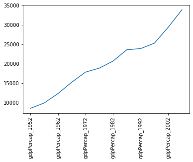
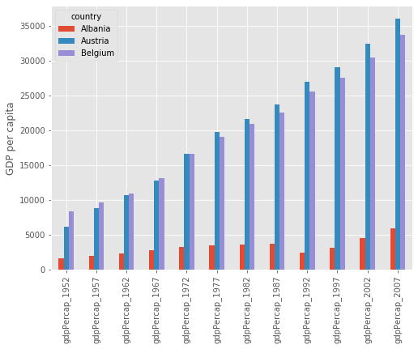

::::::::::::::::::::::::::::::::::::::: objectives

- Learn to load csv data, and obtain simple analyses of the data
- Learn how to index data arrays using column/row labels
- Learn how to mask data to remove unwanted values
- Learn how to plot data directly from pandas

::::::::::::::::::::::::::::::::::::::::::::::::::

:::::::::::::::::::::::::::::::::::::::: questions

- How can I work with spreadsheet style datasets?

::::::::::::::::::::::::::::::::::::::::::::::::::

This library is based on the numpy library that we discuss in a previous lesson. It provides python users with a new object that allows us to work with "relational" or "labelled" data in an easy way. It provides similar access to data loaded from databases or spreadsheets as those found in languages like R.

Pandas is designed more for data science than pure numerical analysis but the required tools can easily be combined together. In addition, the library provides input/output tools that allow the opening and saving of data from MS Excel, CSV or HDF5 files.

The library is usually imported as `pd`:

```python
import pandas as pd
```

Later we will need to plot data - so the matplotlib library should be loaded:

```python
import matplotlib.pyplot as plt
```

We will be working with data in the `data/gapminder_gdp_europe.csv` file. Open this
with a text editor and look at the data layout.

The data within this file is organised much as you'd expect the data within a spreadsheet.  The first row of the file contains the headers for each of the columns. The first column contains the name of the countries, while the remaining columns contain the GDP values for these countries for each year. Pandas has the `read_csv` function for reading structured data such as this, which makes reading the file easy:

```python
data = pd.read_csv('data/gapminder_gdp_europe.csv',index_col='country')
```

Here we specify that the `country` column should be used as the index column (`index_col`).

This creates a `DataFrame` object containing the dataset. This is similar to a numpy array, but has a number of significant differences. The first is that there are more ways to quickly understand a pandas dataframe. For example, the `info` function gives an overview of the data types and layout of the DataFrame:

```python
data.info()
```

```output
<class 'pandas.core.frame.DataFrame'>
Index: 30 entries, Albania to United Kingdom
Data columns (total 12 columns):
 #   Column          Non-Null Count  Dtype
---  ------          --------------  -----
 0   gdpPercap_1952  30 non-null     float64
 1   gdpPercap_1957  30 non-null     float64
 2   gdpPercap_1962  30 non-null     float64
 3   gdpPercap_1967  30 non-null     float64
 4   gdpPercap_1972  30 non-null     float64
 5   gdpPercap_1977  30 non-null     float64
 6   gdpPercap_1982  30 non-null     float64
 7   gdpPercap_1987  30 non-null     float64
 8   gdpPercap_1992  30 non-null     float64
 9   gdpPercap_1997  30 non-null     float64
 10  gdpPercap_2002  30 non-null     float64
 11  gdpPercap_2007  30 non-null     float64
dtypes: float64(12)
memory usage: 3.0+ KB
```

You can also carry out quick analysis of the data using the `describe` function:

```python
data.describe()
```

```output
 	gdpPercap_1952 	gdpPercap_1957 	gdpPercap_1962  ...
count 	30.000000 	30.000000 	30.000000 ...
mean 	5661.057435 	6963.012816 	8365.486814 ...
std 	3114.060493 	3677.950146 	4199.193906 ...
min 	973.533195 	1353.989176 	1709.683679 ...
25% 	3241.132406 	4394.874315 	5373.536612 ...
50% 	5142.469716 	6066.721495 	7515.733738 ...
75% 	7236.794919 	9597.220820 	10931.085347 ...
max 	14734.232750 	17909.489730 	20431.092700 ...
```

## Accessing elements, rows, and columns

The other major difference to numpy arrays is that we cannot directly access the array elements using numerical indices such as `data[0,0]`. It is possible to access columns of data using the column headers as indices (for example, `data['gdpPercap_1952']`), but this is not recommended. Instead you should use the `iloc` and `loc` methods.

The `iloc` method enables us to access the DataFrame as we would a numpy array:

```python
print(data.iloc[0,0])
```

while the `loc` method enables the same access using the index and column headers:

```python
print(data.loc["Albania", "gdpPercap_1952"])
```

For both of these methods, we can leave out the column indexes, and these will all be returned for the specified index row:

```python
print(data.loc["Albania"])
```

This will not work for column headings (in the inverse of the `data['gdpPercap_1952']` method) however. While it is quick to type, we recommend trying to avoid using this method of slicing the DataFrame, in favour of the methods described below.

For both of these methods we can use the `:` character to select all elements in a row or column. For example, to get all information for Albania:

```python
print(data.loc["Albania", :])
```

or:

```python
print(data.iloc[0, :])
```

The `:` character by itself is shorthand to indicate all elements across that indice, but it can also be combined with index values or column headers to specify a slice of the DataArray:

```python
print(data.loc["Albania", 'gdpPercap_1962':'gdpPercap_1972'])
```

If either end of the slice definition is omitted, then the slice will run to the end of that indice (just as it does for `:` by itself):

```python
print(data.loc["Albania", 'gdpPercap_1962':])
```

Slices can also be defined using a list of indexes or column headings:

```python
year_list = ['gdpPercap_1952','gdpPercap_1967','gdpPercap_1982','gdpPercap_1997']
country_list = ['Albania','Belgium']
print(data.loc[country_list, year_list])
```

```output
         gdpPercap_1952  gdpPercap_1967  gdpPercap_1982  gdpPercap_1997
country
Albania     1601.056136     2760.196931     3630.880722     3193.054604
Belgium     8343.105127    13149.041190    20979.845890    27561.196630
```

## Masking data

Pandas data arrays are based on numpy arrays, and retain some of the numpy tools, such as masked arrays. This enables us to apply selection criteria to the datasets, so that only the values that we require are shown. For example, the following selects all data where the GDP is above $10,000:

```python
subset = data.loc['Italy':'Poland', 'gdpPercap_1962':'gdpPercap_1972']
print(subset[subset>10000])
```

```output
             gdpPercap_1962  gdpPercap_1967  gdpPercap_1972
country
Italy                   NaN     10022.40131     12269.27378
Montenegro              NaN             NaN             NaN
Netherlands     12790.84956     15363.25136     18794.74567
Norway          13450.40151     16361.87647     18965.05551
Poland                  NaN             NaN             NaN
```

## Plotting from Pandas

Pandas is integrated with matplotlib, and so data can be plotted directly using the integrated `plot` method. For example, to plot the GDP for Sweden:

```python
data.loc['Sweden',:].plot()
plt.xticks(rotation=90)
```

{alt="Line plot of increase in Sweden's GDP from 1952 to 2002, with no axis labels, and awkward x-axis tick labels."}
Note that we've had to rotate the xtick labels by 90 degrees, because they do not fit neatly under the x-axis. Later we will clean these up properly.

Note that, in the case above, we passed a single column of data to the `plot` method - which it automatically transposed in order to make sense of the plot request (because this method usually works on rows of data). If you want to plot more than one column of data you will need to explicitly transpose the DataFrame yourself.

For example, we will transpose the GDP data for the first 3 countries in our dataset:

```python
print(data.iloc[0:3,:].T)
```

```output
country             Albania       Austria       Belgium
gdpPercap_1952  1601.056136   6137.076492   8343.105127
gdpPercap_1957  1942.284244   8842.598030   9714.960623
gdpPercap_1962  2312.888958  10750.721110  10991.206760
gdpPercap_1967  2760.196931  12834.602400  13149.041190
gdpPercap_1972  3313.422188  16661.625600  16672.143560
gdpPercap_1977  3533.003910  19749.422300  19117.974480
gdpPercap_1982  3630.880722  21597.083620  20979.845890
gdpPercap_1987  3738.932735  23687.826070  22525.563080
gdpPercap_1992  2497.437901  27042.018680  25575.570690
gdpPercap_1997  3193.054604  29095.920660  27561.196630
gdpPercap_2002  4604.211737  32417.607690  30485.883750
gdpPercap_2007  5937.029526  36126.492700  33692.605080
```

This data is now ready to be plotted as a histogram - first we set the style of the plot to match that of the ggplot package in R:

```python
plt.style.use('ggplot')
data.iloc[0:3,:].T.plot(kind='bar')
plt.xticks(rotation=90)
plt.ylabel('GDP per capita')
```

{alt="Bar chart showing the increase in GDP for Albania, Austria, and Belgium from 1952 to 2007."}

:::::::::::::::::::::::::::::::::::::::::  callout

## Saving figures created by pandas

Some python interpreters will, when creating a figure, present you with a graphical
interface that you can use to save the figure. If, however, your interface does not do
this (or you are writing a script which will automatically generate and save the
figures), then you will first need to define a matplotlib figure object, and ensure that
pandas plots your figure inside this.

To do this create a matplotlib subplots object, with handles for the figure (`fig`) and
axis (`axs`) objects. Pass the axis object to pandas when plotting your figure
(`ax=axs`), then use the figure object at the end to save the figure (`fig.savefig`).

```python
fig, axs = plt.subplots()
data.loc['Albania':'Belgium',:].T.plot(kind='bar',ax=axs)
plt.xticks(rotation=90)
plt.ylabel('GDP per capita')
fig.savefig('albania-austria-belgium_GDP.png', bbox_inches='tight')
```

::::::::::::::::::::::::::::::::::::::::::::::::::

:::::::::::::::::::::::::::::::::::::::  challenge

## Changing Column Labels

Note that the x-tick labels have been taken directly from the index values of the transposed DataFrame (which were the original column labels). These don't really need to be more than the year of the GDP values, so we could change the column labels to reflect this.

First we make a new copy of the dataframe (in case anything goes wrong):

```python
gdpPercap = data.copy(deep=True)
```

We have given this new dataframe a more appropriate name, replacing the information that will be removed from the column headers.

Now we will use the inbuilt `str.strip` method to clean up our column labels for the new
dataframe. Which of these commands is correct:

1. `gdpPercap.columns = data.columns.str.strip('gdpPercap_')`
2. `gdpPercap = data.columns.str.strip('gdpPercap_')`

:::::::::::::::  solution

## Solution

The correct answer is 1. We have to pass the new column labels explicitly back to the
array columns, otherwise all we do is replace the data array with a list of the new
column labels.


:::::::::::::::::::::::::

::::::::::::::::::::::::::::::::::::::::::::::::::

:::::::::::::::::::::::::::::::::::::::  challenge

## Plotting GDP increases with time

Now that we've cleaned up the column labels, we now want to plot the GDP data for
Sweden and Iceland from 1972 onwards. The code block we will be using is:

```python
gdp_percap<BLOCK>.T.plot(kind='line')

# Create legend.
plt.legend(loc='upper left')
plt.xlabel('Year')
plt.ylabel('GDP per capita ($)')
```

Which of the following blocks of code should replace the `<BLOCK>` in the code above?

1. `.loc['Sweden':'Iceland','gdpPercap_1972':]`
2. `.loc['gdpPercap_1972':,['Sweden','Iceland']]`
3. `.loc[['Sweden','Iceland'],'gdpPercap_1972':]`
4. `.loc['gdpPercap_1972':,'Sweden':'Iceland']`

:::::::::::::::  solution

## Solution

The correct answer is 3. The two countries are not adjacent in the dataset, so we need
to use a list to slice them, not a range (disqualifying answers 1 and 4). At the point
where we select the countries using `.loc`, we have not yet transposed the dataset
(using `.T`), so the country names are still indexes, not column labels, and therefore
need to be referenced first (ie in the first set of square brackets), (disqualifying
answers 2 and 4).


:::::::::::::::::::::::::

::::::::::::::::::::::::::::::::::::::::::::::::::


:::::::::::::::::::::::::::::::::::::::: keypoints

- CSV data is loaded using the `load_csv()` function
- The `describe()` function gives a quick analysis of the data
- `loc[<index>,<column>]` indexes the data array by the index and column labels
- `iloc[<index>,<column>]` indexes the data array using numerical indicies
- The data can be sliced by providing index and/or column indicies as ranges or lists of values
- The built-in `plot()` function can be used to plot the data using the `matplotlib` library

::::::::::::::::::::::::::::::::::::::::::::::::::


